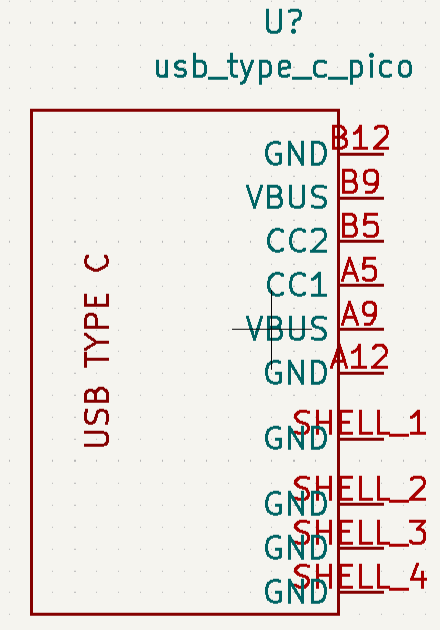
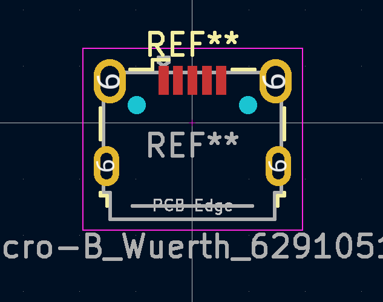
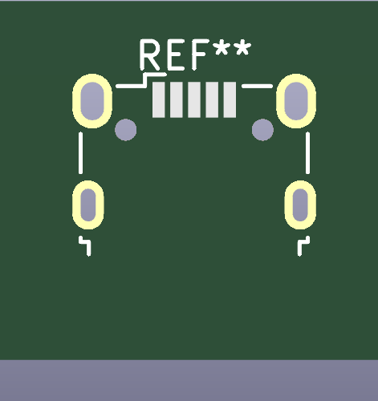

---
hide:
  - navigation
---

# Article

# USB TYPE C

{ .block_image }      { .round_image }        { .bin_image }

- The image on the left is schematic symbol of usb type c
- The image in the middle is footprint of the usb type c
- The image on the right is schematic symbol of usb type c

## SCHEMATIC SYMBOL OF USB TYPE C

A graphical representation of a plan or a model that is presented in a simple.

## FOOTPRINT OF USB TYPE C

The footprint or land pattern is an arrangement of plated copper pads or through-hole plated pads on a PCB on which a component is soldered.

## 3D VIEW OF TYPE C

PCB 3D design software is the best way to ensure your circuit board layout and components satisfy your mechanical constraints as you create your PCB